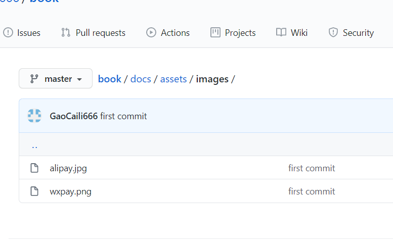

第1题。。。。

5、等待一会就可以使用leetcode.gclstart.top来访问你的gitbook

6、以后提交代码，在book目录下打开git bash，只需执行以下代码

```shell
gitbook build . ./docs
git add *
git commit -m "提交代码"
git push origin master
```


5、等待一会就可以使用leetcode.gclstart.top来访问你的gitbook

6、以后提交代码，在book目录下打开git bash，只需执行以下代码

```shell
gitbook build . ./docs
git add *
git commit -m "提交代码"
git push origin master
```


5、等待一会就可以使用leetcode.gclstart.top来访问你的gitbook

6、以后提交代码，在book目录下打开git bash，只需执行以下代码

```shell
gitbook build . ./docs
git add *
git commit -m "提交代码"
git push origin master
```


5、等待一会就可以使用leetcode.gclstart.top来访问你的gitbook

6、以后提交代码，在book目录下打开git bash，只需执行以下代码

```shell
gitbook build . ./docs
git add *
git commit -m "提交代码"
git push origin master
```


