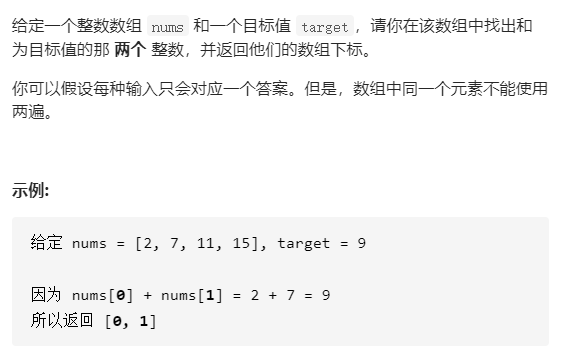

# 题目描述（简单难度）



## 解法一

暴力求解，两层循环

```java
public static int[] twoSum(int[] nums, int target) {
    int[] ans = new int[2];
    for (int i = 0; i < nums.length; i++) {
        for (int j = i + 1; j < nums.length; j++) {
            if (nums[i] + nums[j] == target) {
                ans[0] = i;
                ans[1] = j;
                return ans;
            }
        }
    }
    return ans;
}
```

时间复杂度：O($n^2$)

空间复杂度：O(1)

## 解法二

在解法一中的第二个for循环

```java
for (int j = i + 1; j < nums.length; j++) {
	if (nums[i] + nums[j] == target) {
```

我们换个理解方式

```java
sub=target-nums[i];
for(int j=(i+1);j<nums.length;j++){ 
	if(nums[j]==sub){
```

第二层for循环无非是遍历所有的元素，看哪个元素等于sub，时间复杂度是O(n)

有没有一种方法，不用遍历就可以找到元素里有没有等于sub的？

利用hash table！！！

我们可以把数组的每个元素作为hash的key，下标作为hash的value，为什么不能反过来key-下标，value-元素呢？因为java的HashMap只能通过key找到value，不能通过value找到key，value不是唯一的，key是唯一的。

现在只需判断sub在不在key里面就可以了，而此时的时间复杂度为O(1)。

需要注意的地方是，还需判断找到的元素不是当前元素，因为题目里讲一个元素只能用一次。

```java
public static int[] twoSum(int[] nums, int target) {
    HashMap<Integer, Integer> map = new HashMap<>();
    for (int i = 0; i < nums.length; i++) {
        map.put(nums[i], i);
    }
    int[] ans = new int[2];
    for (int i = 0; i < nums.length; i++) {
        int sub = target - nums[i];
        //现在只要找到sub
        //只要map中包含sub这个key，但是不能是本身这个数
        if (map.containsKey(sub) && map.get(sub) != i) {
            ans[0] = i;
            ans[1] = map.get(sub);
            return ans;
        }
    }
    return ans;
}
```

时间复杂度：比解法一少了一个for循环，降为O(n)

空间复杂度：所谓的空间换时间，这里就能体现出来，开辟了一个 hash table，空间复杂度变为O(n)

## 解法三

看解法二中，两个 for 循环，他们长的一样，我们当然可以把它合起来。复杂度上不会带来什么变化，变化仅仅是不需要判断是不是当前元素了，因为当前元素还没有添加进 hash 里。

```java
public static int[] twoSum(int[] nums, int target) {
    HashMap<Integer, Integer> map = new HashMap<>();
    int[] ans = new int[2];
    for (int i = 0; i < nums.length; i++) {
        int sub = target - nums[i];
        if (map.containsKey(sub)) {
            ans[0] = i;
            ans[1] = map.get(sub);
            return ans;
        }
        map.put(nums[i], i);
    }
    return ans;
}
```

## 总结

hash table的应用，使得时间复杂度从O($n^2$)降为O(n)