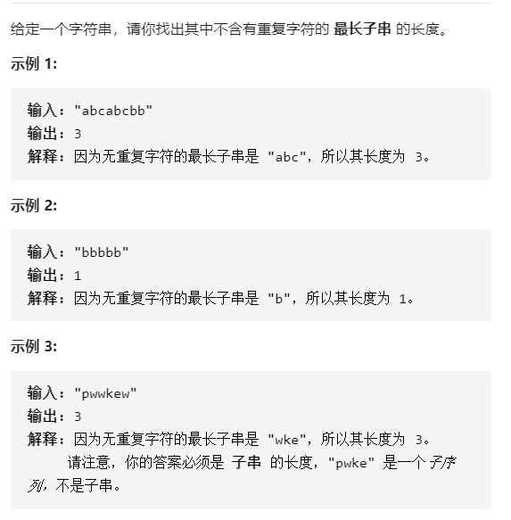
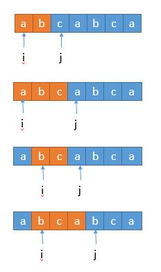
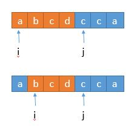
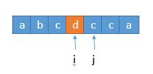

# 题目描述（中等难度）



## 解法一：暴力

暴力求解，找一个最长子串，那么我们用两个循环穷举所有子串，然后再用一个函数判断该子串中有没有重复的字符。

```java
public int lengthOfLongestSubstring(String s) {
    int n = s.length();
    int ans = 0;//保存当前得到满足条件的子串的最大值
    for (int i = 0; i < n; i++)
        for (int j = i + 1; j <= n; j++) //之所以 j<= n，是因为我们子串是 [i,j),左闭右开
            if (allUnique(s, i, j)) ans = Math.max(ans, j - i); //更新 ans
    return ans;
}

public boolean allUnique(String s, int start, int end) {
    Set<Character> set = new HashSet<>();//初始化 hash set
    for (int i = start; i < end; i++) {//遍历每个字符
        Character ch = s.charAt(i);
        if (set.contains(ch)) return false; //判断字符在不在 set 中
        set.add(ch);//不在的话将该字符添加到 set 里边
    }
    return true;
}
```

时间复杂度：O($$n^3$$)

时间复杂度太大了，造成了超时，没有通过leetcode

## *解法二：滑动窗口

上边的算法中，我们假设当 i 取 0 的时候，

j 取 1，判断字符串 str[0,1) 中有没有重复的字符。

j 取 2，判断字符串 str[0,2) 中有没有重复的字符。

j 取 3，判断字符串 str[0,3) 中有没有重复的字符。

j 取 4，判断字符串 str[0,4) 中有没有重复的字符。

做了很多重复的工作，因为如果 str[0,3) 中没有重复的字符，我们不需要再判断整个字符串 str[0,4) 中有没有重复的字符，而只需要判断 str[3] 在不在 str[0,3) 中，不在的话，就表明 str[0,4) 中没有重复的字符。

如果在的话，那么 str[0,5) ，str[0,6) ，str[0,7) 一定有重复的字符，所以此时后边的 j 也不需要继续增加了。i ++ 进入下次的循环就可以了。此时，j不变，不能取j+1。

此时可以理解变成了一个「滑动窗口」。



整体就是橘色窗口在依次向右移动。

判断一个字符在不在字符串中，我们需要遍历整个字符串，遍历需要的时间复杂度就是 O(n)，加上最外层的 i 的循环，总体复杂度就是 O($$n^2$$)。我们可以继续优化，判断字符在不在一个字符串，我们可以将已有的字符串存到 set 集合里，这样的时间复杂度是 O(1)，总的时间复杂度就变成了 O(n)。

```java
public int lengthOfLongestSubstring(String s) {
    int n = s.length();
    int ans = 0, i = 0, j = 0;
    Set<Character> set = new HashSet<>();

    while (j < n) {
        if (!set.contains(s.charAt(j))) {
            set.add(s.charAt(j++));
            ans = Math.max(ans, j - i);
        } else {
            set.remove(s.charAt(i++));
        }
    }
    return ans;
}
```

时间复杂度：在最坏的情况下，while 循环中的语句会执行 2n 次，例如 abcdefgg，开始的时候 j 一直后移直到到达第二个 g 的时候固定不变 ，然后 i 开始一直后移直到 n ，所以总共执行了 2n 次，时间复杂度为 O(n)。

## 解法三：hashmap优化

继续优化，我们看上边的算法的一种情况。



当 j 指向的 c 存在于前边的子串 abcd 中，此时 i 向前移到 b ,此时子串中仍然含有 c，还得继续移动，所以这里其实可以优化。我们可以一步到位，直接移动到子串 c 的位置的下一位！



实现这样的话，我们将 set 改为 map ，将字符存为 key ，将对应的下标存到 value 里就实现了。

```java
public int lengthOfLongestSubstring(String s) {
    int n = s.length();
    int ans = 0;
    Map<Character, Integer> map = new HashMap<>();
    for (int i = 0, j = 0; j < n; j++) {
        if (map.containsKey(s.charAt(j))) {
            i = Math.max(map.get(s.charAt(j)), i);
        }
        ans = Math.max(ans, j - i + 1);
        map.put(s.charAt(j), j + 1);//下标 + 1 代表 i 要移动的下个位置
    }
    return ans;
}
```

与解法二相比

① 这里为什么没有remove掉map之前存的字符，因为 if 语句中进行了Math.max(map.get(s.charAt(j)) + 1, i)，可以保证得到的下标不是 i 前面的

② j 每次循环都进行了自加 1 ，因为 i 的跳跃已经保证了 str[ i , j] 内没有重复的字符串，所以 j 直接可以加 1 。而解法二中，如果子串中包含字符，要保持 j 的位置不变，因为不知道和 j 重复的字符在哪个位置。

③ ans 在每次循环中都进行更新，因为 ans 更新前 i 都进行了更新，已经保证了当前的子串符合条件，所以可以更新 ans 。而解法二中，只有当当前的子串不包含当前的字符时，才进行更新。

④ map的put方法会覆盖原来存在的值，执行下面的代码，最后得到的是6。这样就可以保存字符最新的位置

```java
map.put('a',3);
map.put('a',6);
map.get('a');	//6
```

时间复杂度：我们将 2n 优化到了 n ，但最终还是和之前一样，O（n）。

## 解法四：数组

和解法三思路一样，区别的地方在于，我们不用 map，而是直接用数组，字符的 ASCII 码值作为数组的下标，数组存储该字符所在字符串的位置。适用于字符集比较小的情况，因为我们会直接开辟和字符集等大的数组。

```java
public int lengthOfLongestSubstring(String s) {
    int n = s.length();
    int ans = 0;
    int[] arr = new int[128];   //存放字符所在字符串的位置，字符的 ASCII 码值对应下标
    for (int i = 0, j = 0; j < n; j++) {
        i = Math.max(i, arr[s.charAt(j)]);
        ans = Math.max(ans, j - i + 1);
        arr[s.charAt(j)] = j + 1;   //（下标 + 1） 代表 i 要移动的下个位置
    }
    return ans;
}
```

和解法 3 不同的地方在于，没有了 if 的判断，因为如果 index[ s.charAt ( j ) ] 不存在的话，它的值会是 0 ，对最终结果不会影响。

时间复杂度：O（n）。