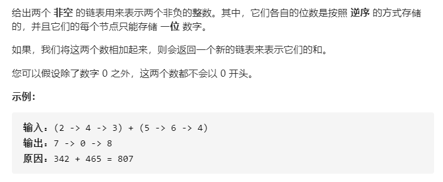

# 题目描述（中等难度）



## 解法

这道题目可以直接求解，但这里面还是有一点技巧的，尤其是下面三句代码

```java
while (l1 != null || l2 != null || carry > 0) {
    int x = (l1 == null) ? 0 : l1.val;
    int y = (l2 == null) ? 0 : l2.val;
```

即使链表到了最后，继续遍历，把它当作0就好了，不影响结果

另外用一个cur指针记录最后一个节点，用于添加新的节点

```java
public ListNode addTwoNumbers(ListNode l1, ListNode l2) {
    ListNode ans = new ListNode(0);
    ListNode cur = ans;
    int carry = 0;
    while (l1 != null || l2 != null || carry > 0) {
        int x = (l1 == null) ? 0 : l1.val;
        int y = (l2 == null) ? 0 : l2.val;
        int sum = x + y + carry;

        carry = sum / 10;

        ListNode node = new ListNode(sum % 10);
        cur.next = node;
        cur = node;

        if (l1 != null) {
            l1 = l1.next;
        }
        if (l2 != null) {
            l2 = l2.next;
        }
    }
    return ans.next;
}
```

初始化的节点 ans 没有存储值，最后返回 ans 的 next 。这样的好处是不用单独对 head 进行判断改变值。也就是如果一开始的 head 就是代表个位数，那么开始初始化的时候并不知道它的值是多少，所以还需要在进入循环前单独对它进行值的更正，不能像现在一样只用一个循环简洁。

时间复杂度：O(max(m, n))，m 和 n分别表示 l1和 l2 的长度。

空间复杂度：O(max(m, n))

